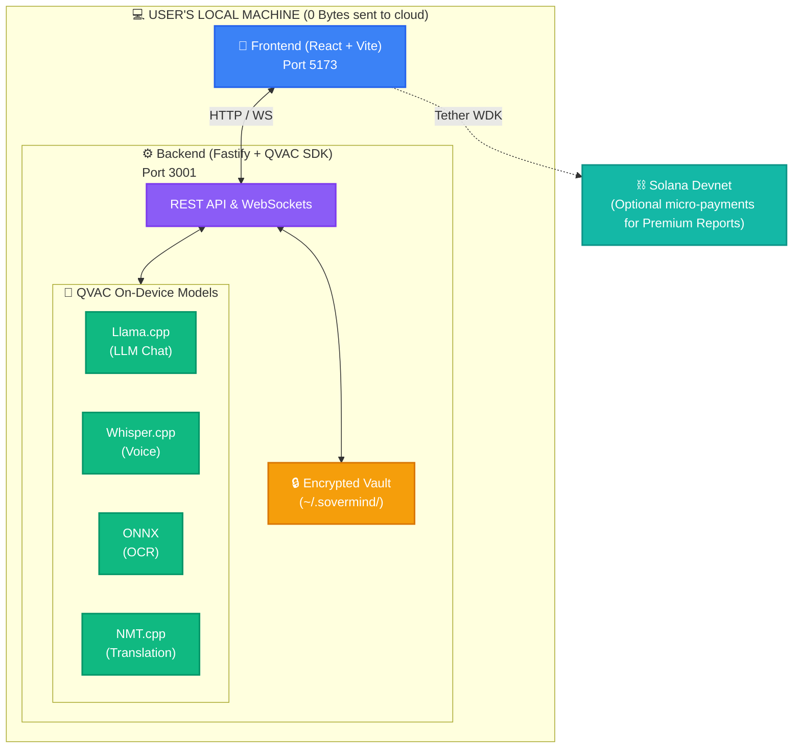

# SOVERMIND
### Private. Offline. Sovereign.

> A local-first AI health companion that runs entirely on your device.  
> Zero bytes sent to the cloud. Ever.

[](https://sovermind.vercel.app)
[](https://explorer.solana.com/address/YOUR_PROGRAM_ID?cluster=devnet)
[](https://qvac.tether.io)
[](./LICENSE)

---

## What is SoverMind?

Most AI health tools route your symptoms, prescriptions, and medical queries through remote servers. SoverMind does not. Every inference — chat, OCR, voice transcription, translation — runs on your local machine using [QVAC](https://qvac.tether.io), Tether's local-first AI SDK.

The result: a health assistant that works offline, respects your privacy by design, and is accessible to users in low-connectivity regions where cloud AI is too slow, too expensive, or simply unavailable.

---

## Demo

> **Live demo (simulated responses):** [sovermind.vercel.app](https://sovermind.vercel.app)  
> For real local AI inference, follow the [Local Setup](#local-setup) guide below.

https://github.com/YOUR_USERNAME/sovermind/assets/demo.mp4

---

## Features

| Capability | QVAC Module | Description |
|---|---|---|
| AI Health Chat | `@qvac/llm-llamacpp` | Ask health questions — LLM answers locally, streams token by token |
| Voice Input | `@qvac/transcription-whispercpp` | Speak your query in any language, transcribed on-device |
| Prescription OCR | `@qvac/ocr-onnx` | Photograph a prescription — medicines extracted and explained |
| Multilingual Output | `@qvac/translation-nmtcpp` | Responses translated to Tamil, Hindi, Swahili offline |
| Premium Reports | Solana + Tether WDK | Pay 0.50 USDT on Solana to unlock a signed PDF health report |

---

## Architecture

SoverMind operates entirely on your machine. The frontend UI communicates with a local backend that directly orchestrates Tether's QVAC SDK for AI inference. **No health data ever leaves your device.**



---

## QVAC Integration

SoverMind uses four QVAC capabilities in a single end-to-end pipeline. Every step runs locally. The byte counter in the header is not a UI trick — it is hardcoded to `0` because no network calls are ever made.

### 🎙️ Voice & Multilingual Chat Pipeline
```mermaid
graph LR
    classDef input fill:#3b82f6,stroke:#2563eb,stroke-width:2px,color:#fff
    classDef model fill:#10b981,stroke:#059669,stroke-width:2px,color:#fff
    classDef output fill:#8b5cf6,stroke:#7c3aed,stroke-width:2px,color:#fff

    V[Voice Input<br/>Tamil]:::input -->|@qvac/transcription-whispercpp| W[Whisper.cpp<br/>Transcription]:::model
    W -->|@qvac/llm-llamacpp| L[Llama.cpp<br/>LLM Inference]:::model
    L -->|@qvac/translation-nmtcpp| T[NMT.cpp<br/>Translation]:::model
    T -->|Displayed to user| O[Response Output<br/>Tamil]:::output
```

### 📄 Prescription Scan Pipeline
```mermaid
graph LR
    classDef input fill:#3b82f6,stroke:#2563eb,stroke-width:2px,color:#fff
    classDef model fill:#10b981,stroke:#059669,stroke-width:2px,color:#fff
    classDef output fill:#f59e0b,stroke:#d97706,stroke-width:2px,color:#fff

    I[Prescription Image]:::input -->|@qvac/ocr-onnx| O[ONNX<br/>OCR Engine]:::model
    O -->|@qvac/llm-llamacpp| L[Llama.cpp<br/>Entity Extraction]:::model
    L -->|AES-256 Encrypted| V[Local Vault<br/>Commit]:::output
```

### Why QVAC over cloud AI?
Cloud AI cannot offer what SoverMind needs:
- **Privacy** — health data never leaves the device
- **Offline** — works with no internet connection
- **Cost** — no per-query API fees for users in low-income regions
- **Sovereignty** — no account, no subscription, no terms of service

---

## Repo Structure

```
sovermind/
├── frontend/                   # React + Vite + TypeScript
│   ├── src/
│   │   ├── components/         # Layout & Shared UI components
│   │   ├── pages/              # Monitor, Scan, Vault
│   │   ├── store/              # Zustand global state
│   │   ├── hooks/              # useQVAC, useSessionLogger
│   │   └── lib/                # QVAC SDK client & Solana integration
│   ├── vercel.json
│   └── .env.example
│
├── backend/                    # Fastify + Node.js
│   ├── src/
│   │   ├── routes/             # health, llm, ocr, transcribe, translate, vault
│   │   ├── services/           # AI services wrapping QVAC modules
│   │   ├── ws/                 # WebSocket streaming handler
│   │   └── lib/                # Model loaders and vault crypto store
│   ├── models/                 # QVAC model files directory (gitignored)
│   └── .env.example
│
└── contract/                   # Anchor (Solana) program
    ├── programs/sovermind/     # Rust smart contracts
    └── scripts/deploy.ts       # Deployment scripts
```

---

## Local Setup

### Prerequisites

- Node.js 20+
- npm 9+
- A GPU with Vulkan support (QVAC runs on any GPU via Vulkan API)

### 1. Clone

```bash
git clone https://github.com/YOUR_USERNAME/sovermind
cd sovermind
```

### 2. Download QVAC models

Place model files in `backend/models/`:

| Model | File | Size | Download |
|---|---|---|---|
| LLM | `mistral-7b-instruct-v0.3.Q4_K_M.gguf` | ~4.1 GB | [HuggingFace](https://huggingface.co/mistralai/Mistral-7B-Instruct-v0.3) |
| Whisper | `ggml-small.bin` | ~466 MB | [HuggingFace](https://huggingface.co/ggerganov/whisper.cpp) |
| OCR | `ocr-model.onnx` | ~200 MB | [QVAC Docs](https://docs.qvac.tether.io) |
| Translation | `models/translation/` | ~500 MB | [QVAC Docs](https://docs.qvac.tether.io) |

> Low-RAM machine (<8GB)? Use `Phi-3-mini-4k-instruct-q4.gguf` (~2.2 GB) instead of Mistral.

### 3. Configure backend

```bash
cd backend
cp .env.example .env
```

Edit `.env`:

```env
LLM_MODEL_PATH=./models/mistral-7b-instruct-v0.3.Q4_K_M.gguf
WHISPER_MODEL_PATH=./models/ggml-small.bin
OCR_MODEL_PATH=./models/ocr-model.onnx
TRANSLATION_MODEL_PATH=./models/translation/
PORT=3001
HOST=127.0.0.1
```

### 4. Start backend

```bash
cd backend
npm install
npm run dev
```

You should see:
```
╔══════════════════════════════╗
║  SOVERMIND BACKEND ACTIVE    ║
║  http://127.0.0.1:3001       ║
║  LLM:           ✓ LOADED     ║
║  OCR:           ✓ LOADED     ║
║  TRANSCRIPTION: ✓ LOADED     ║
║  TRANSLATION:   ✓ LOADED     ║
║  VAULT:         ✓ READY      ║
║  BYTES TO CLOUD: 0           ║
╚══════════════════════════════╝
```

### 5. Start frontend

```bash
cd frontend
cp .env.example .env.local
# set VITE_DEMO_MODE=false in .env.local
npm install
npm run dev
```

Open [http://localhost:5173](http://localhost:5173)

---

## Pages

### Monitor — AI Health Chat
Type or speak a health question. The local LLM streams a response token by token. Select your language from the header — responses are translated on-device.

### Scan — Prescription OCR
Drag and drop a prescription image. The OCR engine extracts text, the LLM identifies medicines and flags warnings. Commit results to the encrypted local Vault.

### Vault — Encrypted Storage
All committed entries are stored in `~/.sovermind/vault.json`, encrypted with AES-256-GCM using a key derived from your machine ID. Unreadable on any other device.

---

## Solana Integration

SoverMind includes an optional micro-payment flow using Tether's [WDK](https://wdk.tether.io):

1. After an AI session, click **Unlock Premium Report** in the Vault
2. Connect your Solana wallet via WDK (non-custodial)
3. Pay 0.50 USDT on Solana devnet
4. Contract stores a hash of your report on-chain (no health data — only a SHA-256 hash)
5. A signed PDF report is generated locally and downloaded

Contract deployed at: `YOUR_PROGRAM_ID_HERE`  
View on explorer: [Solana Devnet Explorer](https://explorer.solana.com/address/YOUR_PROGRAM_ID?cluster=devnet)

---

## Privacy Guarantees

| What | Stays local? |
|---|---|
| Your health queries | ✅ Yes — LLM runs on-device |
| Voice recordings | ✅ Yes — Whisper runs on-device |
| Prescription images | ✅ Yes — OCR runs on-device |
| Vault entries | ✅ Yes — encrypted on disk |
| Translation | ✅ Yes — NMT runs on-device |
| Bytes sent to cloud | ✅ Always 0 |
| Solana tx (optional) | ⚠️ Report hash only — no health data |

---

## Tech Stack

**Frontend:** React 18, Vite, TypeScript, Tailwind CSS, Zustand, React Router  
**Backend:** Node.js 20, Fastify v4, WebSockets, Zod, Pino  
**AI:** QVAC SDK — `@qvac/llm-llamacpp`, `@qvac/transcription-whispercpp`, `@qvac/ocr-onnx`, `@qvac/translation-nmtcpp`  
**Blockchain:** Solana, Anchor, Tether WDK  
**Fonts:** Syne, Source Serif 4, IBM Plex Mono  

---

## Hackathon

Built for [Colosseum Frontier](https://frontier.colosseum.org) hackathon.  
Submitted to the [Tether QVAC side track](https://earn.superteam.fun) — $10,000 prize for meaningful QVAC integration.

**Tether QVAC resources used:**
- [QVAC Homepage](https://qvac.tether.io)
- [QVAC Documentation](https://docs.qvac.tether.io)
- [QVAC GitHub](https://github.com/tetherto/qvac)
- [Tether WDK](https://wdk.tether.io)

---

## License

MIT © 2026 YOUR_NAME
